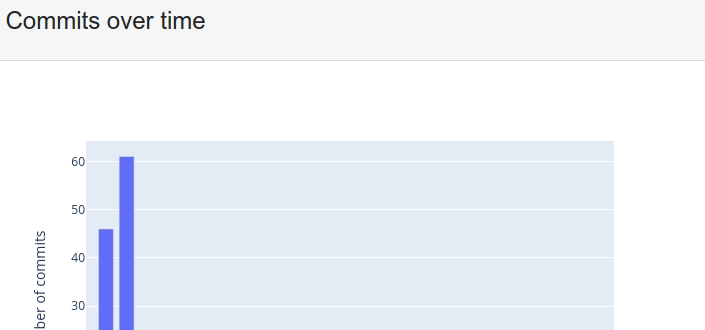
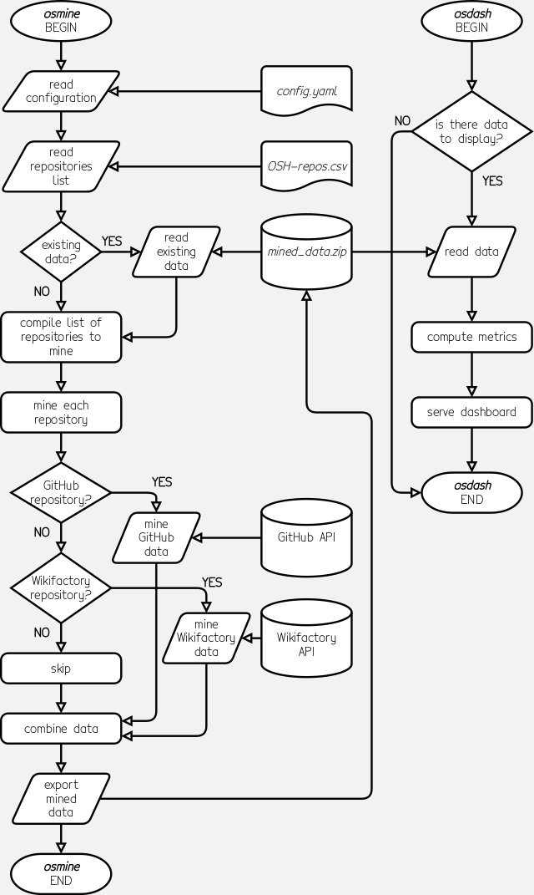

# OSD status dashboard _(wp2.2_dev)_

[](https://opennextwp22.eu.pythonanywhere.com/)
[](https://docs.python.org/3.8/)


[](https://github.com/RichardLitt/standard-readme)
[](https://api.reuse.software/info/github.com/OPEN-NEXT/wp2.2_dev)
[](./CODE_OF_CONDUCT.md)
[](https://www.zenodo.org/badge/latestdoi/258479982)
[](./LICENSE)

*Initial proof-of-concept of open source development status dashboard with data-mining & visualisation components*

This repository contains a set of Python scripts and associated files to host a prototype data visualisation dashboard for open source development projects. It is composed of (a) a data-mining Python module (`osmine`) which mines publicly-viewable metadata from a user-supplied list of open source [version control](https://en.wikipedia.org/wiki/Version_control) repositories; and (b) an interactive [Dash](https://dash.plotly.com/)-based web module (`osdash`) that computes and visualises basic metrics on those repositories. Click [**here**](https://opennextwp22.eu.pythonanywhere.com/) to access a demo instance of the prototype dashboard.

**Please see the [Install](#install) and [Usage](#usage) sections to get up and running with this tool**. For more details on its background and design considerations, please see the [Background](#background), [Design notes](#design-notes), and [Future work](#future-work) sections.

This work is an *initial* demonstrator delivered at month 18 of the [OPENNEXT](https://opennext.eu/) project as part of task 2.2: "Creating a design process facilitation dashboard". It is to establish the foundational infrastructure on which the ambition to facilitate company-community collaboration on open source hardware projects described [below](#background) can be pursued. Future iterations of this tool should allow the community developing an open source hardware product to track the health of their project and if their needs are being met. For the purposes of reviewing OPENNEXT deliverables, there is an **[Executive summary](EXECUTIVE_SUMMARY.md)** available.

## Table of Contents

- [OSD status dashboard _(wp2.2_dev)_](#osd-status-dashboard-wp22_dev)
  - [Table of Contents](#table-of-contents)
  - [Background](#background)
  - [Install](#install)
  - [Usage](#usage)
    - [`osmine` data-mining module](#osmine-data-mining-module)
    - [`osdash` dashboard module](#osdash-dashboard-module)
  - [Design notes](#design-notes)
    - [Internal data structure](#internal-data-structure)
    - [Data-mining](#data-mining)
    - [Data visualisation](#data-visualisation)
  - [Results](#results)
  - [Discussion](#discussion)
  - [Future work](#future-work)
    - [Accessing and analysing file-change histories](#accessing-and-analysing-file-change-histories)
    - [Enhanced project health indicators](#enhanced-project-health-indicators)
    - [Technical improvements](#technical-improvements)
  - [Maintainers](#maintainers)
  - [Contributing](#contributing)
  - [Acknowledgements](#acknowledgements)
  - [License](#license)

## Background

> Today’s industrial product creation is expensive, risky and unsustainable. At the same time, the process is highly inaccessible to consumers who have very little input in the design and distribution of the finished product. Presently, SMEs and maker communities across Europe are coming together to fundamentally change the way we create, produce, and distribute products.

[OPENNEXT](https://opennext.eu/) is a collaboration between 19 industry and academic partners across Europe. Funded by the [European Union](https://europa.eu/)'s [Horizon 2020](https://ec.europa.eu/programmes/horizon2020/) programme, this project seeks to enable small and medium enterprises (SMEs) to work with consumers, makers, and other communities in rethinking how products are designed and produced. [Open source hardware](https://www.oshwa.org/definition/) is a key enabler of this goal where the design of a physical product is released with the freedoms for anyone to study, modify, share, and redistribute copies. These essential freedoms are based on those of [open source software](https://opensource.org/osd), which is itself derived from [free software](https://www.gnu.org/philosophy/free-sw.en.html) where the word free refers to freedom, *not* free-of-charge. When put in practice, these freedoms could potentially not only reduce proprietary vendor lock-in, planned obsolescence, or waste but also stimulate novel – even disruptive – business models. The SME partners in OPENNEXT are experimenting with producing open source hardware and even opening up the development process to wider community participation. They produce diverse products ranging from [desks](https://stykka.com/), [cargo bike modules](http://www.xyzcargo.com/), to a [digital scientific instrument platform](https://pslab.io/) (and [more](https://opennext.eu/project-team/#sme)).

Work package 2 of OPENNEXT is gathering theoretical and practical insights on best practices for company-community collaboration when developing open source hardware. This includes running [Delphi studies](https://www.edelphi.org/) to develop a maturity model to describe the collaboration and developing a precise definition for what the "source" is in open source hardware. In particular, task 2.2 in this work package is developing a project status dashboard with "health" indicators showing the evolution of a project within the maturity model; design activities; or progress towards success based on project goals.

To that end, the month 18 deliverable for task 2.2 is focused on establishing the underlying infrastructure to mine data about open source hardware projects from version control repositories that they are hosted on (`osmine`). The Python scripts in this repository currently query the public [application programming interfaces](https://en.wikipedia.org/wiki/API) (APIs) of [GitHub](https://www.github.com/) and [Wikifactory](https://www.wikifactory.com/). Both host version control repositories with the latter having a focus on supporting open source hardware projects. There is also a user-facing demonstration dashboard (`osdash`) which computes core metrics from the the mined data and presents interactive visualisations. Currently, post-month-18 development is envisaged to include, but not limited to (elaborated in [Future work](#future-work) section): 

* Modules to query other platforms such as [GitLab](https://gitlab.com/) or generic Git repositories;
* Logging
* Network visualisations of file co-edition histories and participation in tickets (e.g. GitHub Issues) with cluster analyses
* Compute indicators for the dashboard derived from the company-community collaboration maturity model under development
* Validate with OPENNEXT SME partners

There are other excellent open source software for open source project analytics and data visualisation, with [Grimoirelab](https://chaoss.github.io/grimoirelab/) being a prime example. However, the full Grimoirelab pipeline requires a full server stack necessitating advanced skills in heavy-duty (but potentially complicated) web technologies such as [Kibana](https://www.elastic.co/products/kibana) or [Elastisearch](https://www.elastic.co/products/elasticsearch). This project aims to create a lighter, more focused solution needing only the use of Python.

This documentation aims to demonstrate practices that facilitate design reuse, including of this repository. In addition to the [Install](#install) and [Usage](#usage) sections that increase reproducibility, [Design notes](#design-notes) and [Future work](#future-work) communicate the thought process and lessons-learned while developing the dashboard. Together, they constitute an intangible body of "know-how" that is very often undocumented. For example, motivations for the internal data model or the approach to compressing data a the end of the section [Internal data structure](#internal-data-structure) which reduces disk usage are of practical benefit. But "snippets" of practical experience like these are seldom recorded.

In addition, this repository aims to follow international standards and good practices in open source development such as, but not limited to: 

* [SDPX](https://spdx.dev/) compliance with a [LICENSE](./LICENSE) file (also see [License](#license) section)
* [REUSE](https://reuse.software/) compliance with appropriate machine-readable SPDX metadata for all files and license texts in [`LICENSES`](./LICENSES/) directory
* README file (this document) conforming to the [Standard Readme Specification](https://github.com/RichardLitt/standard-readme)
* [Contributor Covenant](https://www.contributor-covenant.org/) Code of Conduct for participants
* [CONTRIBUTING](./CONTRIBUTING.md) document outlining ways to contribute to this repository
* Naming the primary branch of this repository `main` instead of `master` following [modern best practices](https://github.blog/changelog/2020-10-01-the-default-branch-for-newly-created-repositories-is-now-main/)

## Install

*This section assumes basic knowledge of Python and using a GNU/Linux operating system including installing software and running a terminal session*.

This project requires [Python](https://www.python.org/) 3.8 or later and setting up a [virtual environment](https://docs.python.org/3.8/tutorial/venv.html) is optional but recommended. Detailed external library dependencies are listed in the standard-conformant [`requirements.txt`](./requirements.txt): 

* [`dash>=1.16.0`](https://pypi.org/project/dash/)
* [`dash-bootstrap-components>=0.11.1`](https://pypi.org/project/dash-bootstrap-components/)
* [`numpy~=1.17.3`](https://pypi.org/project/numpy/)
* [`pandas~=0.25.2`](https://pypi.org/project/pandas/)
* [`plotly>=4.10.0`](https://pypi.org/project/plotly/)
* [`PyYAML~=5.1.2`](https://pypi.org/project/pyyaml/)
* [`requests~=2.22.0`](https://pypi.org/project/requests/)

In addition to Python and the dependencies listed above, the following programs must be installed and accessible from the command line: 

* [`git`](https://git-scm.com/) (version 2.7.4 or later)
* [`pip`](https://pip.pypa.io/) (version 19.3.1 or later)

A [GitHub personal access token](https://docs.github.com/en/github/authenticating-to-github/creating-a-personal-access-token) is required because the Python scripts will use it for GitHub API queries. Future versions may make this optional if none of the repositories passed to the data-miner `osmine` are hosted on GitHub.

Currently, the code is set up to be run from source and has been tested on updated versions of GNU/Linux operating systems including [Red Hat Enterprise Linux](https://redhat.com/en/technologies/linux-platforms/enterprise-linux) 8.3 and [Debian](https://www.debian.org/) 10. While effort has been made to keep the Python scripts platform-agnostic, they have not been tested under other operating systems such as [BSD](https://en.wikipedia.org/wiki/Berkeley_Software_Distribution)-derivatives, [Apple macOS](https://www.apple.com/macos/) or [Microsoft Windows](https://www.microsoft.com/windows/) as they are rarely used for hosting code such as this. Viewing and interacting with the user-facing dashboard `osdash` has been tested with the [Mozilla Firefox](https://www.mozilla.org/firefox/) 85 web browser.

With the tools [`git`](https://git-scm.com/) and [`pip`](https://pip.pypa.io/) installed, run the following commands in a terminal session to retrieve the latest version of this repository and prepare it for development and running locally (usually for testing): 

```sh
git clone https://github.com/OPEN-NEXT/wp2.2_dev.git
pip install --user -r requirements.txt
```

The [`git`](https://git-scm.com/) command will download the files in this repository onto your local system into a directory named `wp2.2_dev`, and [`pip`](https://pip.pypa.io/) installs the Python packages listed in [`requirements.txt`](./requirements.txt) required for `osmine` and `osdash` to work.

For production, one could run the code on a self-hosted [Web Server Gateway Interface (WSGI)](https://docs.python.org/3/library/wsgiref.html) [Flask](https://palletsprojects.com/p/flask/) server. Setting up a WSGI server is beyond the scope of this documentation, but it may be easier use a pre-configured WSGI instance such as on platforms like [PythonAnywhere](https://eu.pythonanywhere.com/) (where [the demo instance](https://opennextwp22.eu.pythonanywhere.com/) is hosted). To do so, please follow the instructions [here](https://csyhuang.github.io/2018/06/24/set-up-dash-app-on-pythonanywhere/) where `from dashing_demo_app import app` would be replaced by `from osdash import app`.

**Optional:** Configure the port at which the dashboard can be accessed in testing mode. This is done by modifying the the last line of `osdash/__main__.py`:
```python
app.run_server(debug=True, port=[port number])
```
where `[port number]` can be any integer of your choice. The default has been arbitrarily set to `21110`.

## Usage

*This section assumes basic knowledge of Python and using a terminal session in a GNU/Linux operating system*.

After following the steps in the [Install](#install) section, change directories into `wp2.2_dev`: 

```sh
cd wp2.2_dev
```

All paths used in the rest of this document are relative to the `wp2.2_dev` base directory.

### `osmine` data-mining module

This module should be run first to produce the dataset for the `osdash` dashboard to visualise. The following is the typical sequence of execution:

1. Prepare list of repositories to mine.
   
    Currently, only GitHub repositories and Wikifactory projects are supported. The list must be saved in a [comma-separated values](https://tools.ietf.org/html/rfc4180) (CSV) file with the following named columns: 
    
    * `project` - Name of the project that this repository belongs to. This is to accommodate situations where an open source project with work split among multiple repositories.
    * `repo_url` - Fully qualified [universal resource locator](https://en.wikipedia.org/wiki/URL) (URL) of the repository starting with `https://`. Example valid URLs for GitHub and Wikifactory repositories are `https://github.com/octocat/Hello-World/` and `https://wikifactory.com/+elektrictube/pikon-telescope`. **Note:** Wikifactory URLs could have custom domains and not be `wikifactory.com`. This will not by itself trigger errors in `osmine`.
    * `repo_platform` - One of `GitHub` or `Wikifactory` (case-sensitive). This tells `osmine` which APIs to use when querying repository metadata.
    * `notes` - This is ignored by the script and is for your own notes.

    An example CSV list is included with this repository in [`input/OSH-repos.csv`](./input/OSH-repos.csv) and can be used out-of-the-box. This list was used to obtain the data visualised in the dashboard [demo instance](https://opennextwp22.eu.pythonanywhere.com/).

2. Obtain a [GitHub personal access token](https://docs.github.com/en/github/authenticating-to-github/creating-a-personal-access-token), which is a 40-character alphanumeric string in the form of `22x9w3npi629wgam5s6xxxen5abrozeb3db2mr42`. A GitHub account is required for this step. This token can be fed to `osmine` as: The environment variable `GH_TOKEN`; a path to a one-line pure-text file containing the string as a command line argument (see step 4); or directly in the configuration file (see step 3.).

3. Set up configuration file.
  
    The configuration file is formatted in [YAML](https://yaml.org/) and a commented example is provided in [`config.yaml`](./config.yaml). The same options can also be provided as command line arguments when running `osmine`. The most important piece of information is the path to a CSV file from step 1. For example, the path to the example list included with this repository would be [`input/OSH-repos.csv`](./input/OSH-repos.csv). The path to a file containing the GitHub access token can also be specified here.

4. Run `osmine` to query GitHub and Wikifactory APIs for repository metadata.
   
    The basic command to run in a terminal session is: 

    ```sh
    python osmine
    ```

    Unless provided elsewhere, these two command line arguments are the most important: **`-t`** - path to file containing GitHub access token; **`-r`** - path to CSV file containing list of repositories to query. Here is a full example assuming a pure-text file named `token` containing the GitHub token string has been placed in the base directory of `wp2.2_dev`: 

    ```sh
    python osmine -t=./token -r=./input/OSH-repos.csv
    ```

5. The `osmine` module will preprocess inputs provided in the steps above and existing data using this logic: 

    1. Read CSV list of repositories to query.
    2. Check if `osmine` has been run before and previously mined data has been saved.
    3. If there is past data, compare it against CSV list and determine the timestamp of when each repository was last mined. **Note:** If there is a new repository in the CSV list that has not be mined before (no past data), then its "last mined" timestamp will be set to the beginning of the [UNIX epoch](https://en.wikipedia.org/wiki/Unix_time) (00:00:00 UTC on 1st January 1970), long before version control software is known to exist.

6. The `osmine` module will run, using its internal GitHub and Wikifactory modules ([`osmine/miner/GitHub.py`](./osmine/miner/GitHub.py) and [`osmine/miner/Wikifactory.py`](./osmine/miner/Wikifactory.py)) to query the provided list of repositories. At time of writing, the GitHub API allows filtering results by time to reduce network usage. `osmine` will use the "last mined" timestamp described above to only query for data after that timestamp and append the results to previously saved data.

7. Once data-mining is complete, the results will be saved in a [JSON](https://www.json.org/json-en.html) file with 4-spaces indentation (`mined_data.json`) contained in a compressed archive `data/mined_data.zip`. Currently this behaviour is hard-coded in the Python script [`osmine/postprocess/exporter.py`](./osmine/postprocess/exporter.py).

If no visualisation is needed, then there is no need to run anything else. The mined data file `data/mined_data.zip` can be used in other applications. See [Design notes](#design-notes) section on how the data file is structured.

### `osdash` dashboard module

The `osmine` data-mining module must be run at least once – with `data/mined_data.zip` in place – so that there is data for the `osdash` dashboard to visualise. `osdash` will not run without the data file.

Alternatively, if you want to only test `osdash` without running `osmine` first, there is already an example [`data/mined_data.zip`](./data/mined_data.zip) in this repository with data mined from the example list [`input/OSH-repos.csv`](./input/OSH-repos.csv).

The following steps will start a local test instance of the dashboard:

1. Run the following command to start the dashboard: 

    ```sh
    python osdash
    ```

    This will start the test server using mined-data from `osmine` saved in `data/mined_data.zip`. The initialisation process will take at least several seconds to serve the dashboard webpage.

2. Unless the default port number was changed (see [Install](#install) section), open the dashboard's URL in a web browser such as [Mozilla Firefox](https://www.mozilla.org/firefox/): 
   
   `http://127.0.0.1:21110` (no `https://` in this case)

   Replace `21110` with another number if you changed the port. After a few seconds, the dashboard should be visible in your browser window.

3. There should already be statistics shown for a repository. If the example `input/OSH-list.csv` was used by `osmine`, then the dashboard should be showing information on the [Airpup](https://github.com/mathewlippincott/airpup-balloon) open source hardware aerial sensing platform.

4. The left side of the page is a sidebar for configuring which repository's information to show. Follow the numbered steps in order to customise the view.

5. In this proof-of-concept version of the dashboard, the timeframe slider in the sidebar will constrain the data shown in the repository view to the right. This view has three components: 
   
   * Basic information about the cumulative number of commits, tickets (opened and closed), and contributors in the repository.
   * An interactive plot of the number of commits per month in this repository. Interactive elements will appear after hovering the mouse cursor over the top of the plot: 

    
   **Figure 1.** Hovering the mouse cursor over a dashboard plot will reveal interaction tools.
   
   * A table showing the list of users (shown as usernames) who have contributed to this repository including their number of commits and the tickets they have participated in. Participation can be either opening or commenting on a ticket.

6. (*optional*) If `osdash` is running on a publicly-accessible WSGI server over the Internet instead of a local test instance (see [Install](#install) section), the dashboard could be embedded into generic [HTML](https://html.spec.whatwg.org/multipage/) web pages with an [`iframe`](https://html.spec.whatwg.org/multipage/iframe-embed-object.html#the-iframe-element) element. Details are beyond the scope of this document, but the `iframe` element would looke like: 
    ```html
    <iframe src="[url]">
    ```
    where `[url]` is the publicly accessible URL at which the dashboard is hosted.
## Design notes

The essential sequence of operation for `osmine` and `osdash` has been described in the [Usage](#usage) section above. The following flowchart depicts that sequence: 


**Figure 2.** Sequence of events when running the `osmine` data-mining script and the `osdash` data visualisation dashboard.

To re-iterate, the following in a textual description of the steps in the flowchart: 

1. `osmine` is run before `osdash` unless there is already data from previous runs to visualise.
2. `osmine` reads the configuration file `config.yaml` which specifies the path to list of repositories to mine and where to store the fetched data.
3. The list of repositories to mine is read from a CSV file (e.g. `input/OSH-repos.csv`).
4. If there is data from previous runs of `osmine` (e.g. `data/mined_data.zip`), it is read into memory.
5. The repositories from previously mined data and the list that was read in step 3 are combined into a list of repositories to mine in this run.
6. `osmine` iterates through the URLs of each repository in the list and calls the GitHub or Wikifactory API by parsing the URLs.
7. Data returned by the APIs are combined.
8. The combined data is exported to a data file (e.g. `data/mined_data.zip`) for use by the `osdash` interactive dashboard.
9. With a data file now in place (e.g. `data/mined_data.zip`), `osdash` can be run.
10. `osdash` checks for presence of the data file, and should end if it does not exist.
11. The data file is read into memory.
12. Metrics (such as the number of commits to each repository each month) are computed.
13. The interactive dashboard is served either directly by the Dash Python module or by a Flask server.

The rest of this section describes the thought-process and decisions made when developing key components of this program.

### Internal data structure

The GitHub and Wikifactory APIs respond to queries with JSON-formatted data strings. However, the data fields and how they are structured differ between the two platforms. To standardise the internal data structure used by `osmine` and `osdash` in a non-arbitrary way, the [ForgeFed data model](https://forgefed.peers.community/modeling.html) was used as a starting point. [ForgeFed](https://forgefed.peers.community/) is a new "[federation](https://en.wikipedia.org/wiki/Federation_(information_technology)) protocol for enabling interoperability between version control services". Relevant to the work in this repository is the standard [ForgeFed data model](https://forgefed.peers.community/modeling.html) that describes the essential elements of a version control repository. This includes: 

* `Repository` - Basic information about the whole repository.
* `Branch` - A named reference to a point along a version-controlled repository's revision history. In practice, this allows developers to work on different parts of a complex software project which can later be "[merged](https://git-scm.com/book/en/v2/Git-Branching-Basic-Branching-and-Merging)" into a primary branch. This is implemented in Git (and hence GitHub) but not currently by Wikifactory.
* `Commit` - The fundamental unit representing every change that is tracked in a repository's revision history. This is referred to as a "contribution" in Wikifactory.
* `Ticket` - Discussion topics related to the repository, known as "Issues" in GitHub and Wikifactory.

API query results from GitHub and Wikifactory are mapped into an internal data structure that matches the ForgeFed data model as closely as possible. For our purposes, additional fields not defined by ForgeFed were added such as one for recording the last time a repository was mined by `osmine` (introduced above). While `osmine` and `osdash` are running, this internal data is contained in a Python `list` object where each list item contains the following components described in [YAML](https://www.yaml.org/)-formatted schema: 

```yaml
Repository:              # dict
  - name: str            # GitHub repository name i.e. the name part of owner/name in URL; Wikifactory project name from URL project name slug
  - attributedTo: str    # GitHub `owner` name in owner/namer in URL; Wikifactory project creator username
  - published: str       # GitHub repository's `dateCreated`; Wikifactory project's `dateCreated`
  - project: str         # (*) The project that this repository belongs to, e.g. multiple GitHub repositories belong to the Pocket Science Lab project
  - forkcount: int       # (*) GitHub provides this number directly; Wikifactory 0 for now
  - forks: list          # (*) GitHub list of forks URLs; Wikifactory null for now
  - license: str         # (*) GitHub provides a SPDX string directly; Wikifactory results are mapped to SPDX strings
  - platform: str        # (*) "GitHub" or "Wikifactory"
  - repo_url: str        # (*) This string should match what's in the repository list URLs
  - last_mined: str      # (*) ISO 8601 timestamp; this is saved each time the repository is successfully mined
Branches:                # list
  - Branch:              # dict
    - name: str          # Directly provided by GitHub, null for Wikifactory for now since branches are not implemented
Commits:                 # list
  - Commit:              # dict
    - committedBy: str   # GitHub author username and Wikifactory creator username
    - committed: str     # ISO 8601-formatted GitHub `authored` time and Wikifactory `dateCreated`
    - hash: str          # GitHub commit `hash`; Wikifactory contribution `id`
    - summary: str       # GitHub one-line title; Wikifactory contribution title
    - parents: list      # (*) GitHub normally one or two hashes; Wikifactory always seems to be one id since there are no branches to merge for now
    - url: list          # (*) GitHub and Wikifactory URLs to commit. GitHub gives this directly; for Wikifactory you need to construct this from project URL and contribution slug.
Tickets:                 # list
  - Ticket:              # dict
    - attributedTo: str  # GitHub and Wikifactory username
    - summary: str       # GitHub title and Wikifactory title
    - published: str     # ISO 8601-formatted GitHub `publishedAt` and Wikifactory `dateCreated`
    - isResolved: bool   # True/False from GitHub `closed` and Wikifactory `status`
    - resolved: str      # ISO 8601-formatted GitHub `closedAt` and Wikifactory empty string if not resolved, `lastActivityAt` if resolved (need to check if `lastActivityAt` matches actual resolve timestamp)
    - id: str            # (*) GitHub issue number and Wikifactory issue id
    - participants: list # (*) List of strings of usernames of anyone who has participated in this issue. Right now this probably means just commentors plus the original creator. (e.g. `creator` and `commentor` `username`s in Wikifactory API)
    - url: str           # (*) URL to issue. GitHub's API gives this directly, for Wikifactory will need project URL plus issue slug.
```

The schema above includes the Python data type for each field (i.e. `dict`, `list`, `int`, `str`, `bool`) with comments (denoted by `#`) explaining how it maps to data returned by the GitHub and Wikifactory APIs (`(*)` denotes a data field not in the standard ForgeFed data model).

This data is exported at the end of `osmine`'s execution into a JSON file (`mined_data.json`) that is subsequently compressed into an archive (`data/mined_data.zip`) using compression level 9 of the [DEFLATE](https://docs.python.org/3.8/library/zipfile.html#zipfile.ZIP_DEFLATED) algorithm as implemented by Python 3.8's internal [`zipfile`](https://docs.python.org/3.8/library/zipfile.html) module. The [`zipfile`](https://docs.python.org/3.8/library/zipfile.html) module was chosen because it allows creating the JSON file *and* compressing it into the archive in one disk operation. This reduces disk usage when compared to saving a JSON file to disk, compressing it into a separate compressed archive, then deleting the original JSON file (three disk read/write operations).

The dashboard module `osdash` reads the data file and computes the metrics and visualisations as described in the [Usage](#usage) section.

### Data-mining

One way to mine data from a version control repository is to download it directly. However, some repositories, especially those developing open source hardware with binary format computer-aided design (CAD) files, can take up hundreds of megabytes. This will substantially increase the time, network bandwidth, and storage space needed when mining many repositories to the point of being impractical.

The solution implemented in `osmine` is to use the Python [`requests`](https://requests.readthedocs.io/) library to query APIs provided by GitHub and Wikifactory. Queries are essentially text strings written in the [GraphQL](https://graphql.org/) langauge which allow highly granular requests for data. For example, a GraphQL query may request the username of the person who made a particular commit to a certain repository and only that information would be returned. In contrast, previous-generation [representational state transfer](https://en.wikipedia.org/wiki/Representational_state_transfer) (REST) queries are less expressive, and obtaining that username may require a query for *all* metadata for a commit including its creation time, summary text, URL, and other information. Fortunately, the latest versions of the GitHub and Wikifactory APIs support GraphQL queries making the data-mining task performed by `osmine` more time and network-bandwidth efficient. Since these queries only request *metadata*, the large downloads associated with downloading whole repositories are avoided.

One design goal of `osmine` is modularity in the supported version control platforms. For example, the main data-mining script `osmine/miner/mine.py` calls separate scripts for GitHub (`osmine/miner/GitHub.py`) and Wikifactory (`osmine/miner/Wikifactory.py`) then combines the data before it is saved by the export script (`osmine/postprocess/exporter.py`). The hope is that support for other platforms such as GitLab or generic Git repositories can be added by adding scripts specific to them under `osmine/miner`. This will reduce duplication of code and increase the maintainability of the codebase.

### Data visualisation

The most widely used Python scientific plotting libraries such as [Matplotlib](https://matplotlib.org/) are focused on producing static images for offline viewing. By design, the `osdash` dashboard is to be delivered online with interactive and dynamic data visualisations. To that end, we decided to utilise the [Dash](https://dash.plotly.com/) framework which was created for building "web analytic applications". Dash allows the creation of web applications with complex, dynamic, and interactive data visualisations arranged on a unified canvas using Python. These tasks were traditionally done with web-focused programming languages such as HTML, [CSS](https://www.w3.org/Style/CSS/), or [Javascript](https://en.wikipedia.org/wiki/JavaScript). Dash allowed us to conduct all development in Python, the only language we are familiar with, thereby saving substantial time and effort. Other benefits of Dash are its maturity, active development, and strong community support.

In addition, the Dash framework includes components (such as [Cytoscape](https://dash.plotly.com/cytoscape)) for visualising and interacting with network graphs. This was an important factor when we chose Dash as the basis of our `osdash` dashboard module as our future work aspires to implement these visualisations.

Notably, a live Dash web app automatically reloads when the underlying Python code is changed. This saves time during development since we can edit the code of the `osdash` module and changes (or errors) are immediately reflected in the web browser. Lastly, the Dash framework is a piece of commercially successful open source software. This aligns with the theme of OPENNEXT which is to study models of commercially-produced open source hardware.

There is no strict limitation on where Dash web apps can be hosted. However, since the [demo instance](https://opennextwp22.eu.pythonanywhere.com/) of the `osdash` module is currently hosted on [PythonAnywhere](https://eu.pythonanywhere.com/), the version numbers of the dependencies for this repository listed in [`requirements.txt`](./requirements.txt) are based on [those offered](https://eu.pythonanywhere.com/batteries_included/) by their default Python 3.8 environment.

## Results

The `main` branch of this repository reflects the status of development at month 18 of the OPENNEXT project. At this time, we have achieved for the dashboard: 

1. Underlying algorithms to fetch project metadata (such as participant list, commit history, ticket activity) from their respective version control repository hosted on GitHub or Wikifactory.
2. A minimum viable online dashboard that demonstrates interactive visualisations of the underlying data.

The [Design notes](#design-notes) section described in more detail the design process. The following section addresses how the current state of this dashboard will facilitate future work.

## Discussion

The development of this demonstrator deliverable benefited from and was informed by work by work package 2 and work package 3 including the developers behind Wikifactory. This process is fruitful for idea cross-pollination and reducing duplication of effort. We intend to continue and expand this collaboration model to include OPENNEXT SME partners to gain input from their real-life practical experience.

One way to mine data from a version control repository is to download it directly. However, some repositories, especially those developing open source hardware with binary format computer-aided design (CAD) files, can take up hundreds of megabytes. This will substantially increase the time, network bandwidth, and storage space needed when mining many repositories to the point of being impractical. That is the rationale for our current solution which uses the APIs of open source project hosting platforms such as GitHub and Wikifactory to retrieve only the metadata we need at finer resolution. One challenge is our desire to expand the supported platforms of our tool, such as GitLab or generic Git repositories. However, each has a different API which provides not only differently structured data responses but also in their content. There might be information we can retrieve from one platform that is not available from another.

One of our major ambitions is to investigate community collaboration patterns in open source development by analysing the file-change commit histories of their version control repositories. This information allows us to contruct file co-edition graphs using commit authorship data. Nodes in such a graph would be those who have made a commit and an edge between two nodes would be formed if they have committed changes to the same files. And since each commit has a timestamp, we could observe how the structure of the graph changed over time and perform clustering or modularity analyses to quantify that evolution. We hypothesise that the evolution of such a graph would reflect changes in a repository's developer community over time. This will be discussed further in the following section.
## Future work

This section describes future work that we hope to conduct with the foundation that the month 18 deliverable established. These are aspirations where the specifics of how they are implemented might be subject to change.
### Accessing and analysing file-change histories

In a typical version control system such as [Git](https://git-scm.com/) (on which GitHub is based), the metadata of a commit includes the author and a list of files that were changed. This crucial piece of data allows us to construct not only the complete file-change history of a repository, but also file co-edition graphs using authorship data. Nodes in such a graph would be those who have made a commit and an edge between two nodes would be formed if they have committed changes to the same files. And since each commit has a timestamp, we could observe how the structure of the graph changed over time and perform clustering or modularity analyses to quantify that evolution. We hypothesise that the evolution of such a graph would reflect changes in a repository's developer community over time.

A major barrier to building a repository's file-change history is that while the current GitHub GraphQL API allows requesting the *list* of commits that have been made in a repository, there is no way to retrieve the list of files that were changed in an *individual* commit. To obtain that information, we need to query *each* commit in a repository with GitHub's older REST API. Since each repository could have hundreds, sometimes thousands, of commits, and that we would like to study the file-change histories of many repositories (possibly hundreds), the number of API queries would increase exponentially with the number of repositories. This is impractical not only because of how much time the API queries would take, but also that GitHub caps the number of API requests allowed from the same source every hour. One solution is to download a copy of the entire repository and directly access its commit history. However, as previously discussed, this is time-consuming and takes up substantial storage.

To our knowledge, the most promising solution at time of writing is to use Git's [internal transfer protocols](https://git-scm.com/book/en/v2/Git-Internals-Transfer-Protocols) to request metadata. These protocols allow low-level access to the "behind the scenes" mechanisms of a Git repository and bypass the limitations of GitHub's high-level (albeit easier to use) API. Since every GitHub repository is also a valid Git repository, communicating with it via the Git internal transfer protocols will likely allow granular access to specific pieces of metadata (such as the files changes in a commit) without the overheads described above. This is an advanced and complex technique but worth further investigation. Python packages such as [GitPython](https://gitpython.readthedocs.io/) or [PyDriller](https://pydriller.readthedocs.io/) may aid this effort.

It should also be noted that a graph of community interactions need not be based exclusively on file co-edition histories. Since we also mine data on tickets (i.e. GitHub and Wikifactory issues), user interactions there can also form edges in the graph. Including these activites could form a more complete representation of community structure.

### Enhanced project health indicators

After month 18, we hope to gather feedback from the OPENNEXT SMEs producing open source hardware on which indicators they believe would aid their development process. Certain indicators may require development of methods to acquire deeper insights from repository metadata. For example, by studying the evolution of a large number of open source hardware repositories, we might see typical structures that reflect different stages of development. This could be used to derive a "project stage" indicator showing if a project is in the ideation, prototyping, or production stages. This collaboration with SMEs may include workshops to get direct feedback leading to iterative design/feedback loops to test different indicators. We could also use asynchronous methods such as feedback surveys where OPENNEXT SMEs and outside projects can describe which factors they consider useful when tracking the health of their development efforts.

There is also work by Rafaella Antoniou of the OPENNEXT project to define typical open source project "archtypes" with indicators related to each one. For example, if file changes in a project's version control history are primarily contributed by one user, it may be a strong indicator that the project belongs to the "centralised development" archtype. The dashboard could incorporate these indicators and show which archtype a project likely belongs to.

Additionally, the maturity model under development by OPENNEXT work package 2 will also be useful in creating indicators reflecting different stages in the model. More study is needed to ascertain whether repository metadata is sufficient for deriving those indicators.

By parsing the types of files in a repository, we may infer the skills needed to contribute to a project. For example, the presence of [STL](https://en.wikipedia.org/wiki/STL_(file_format)) files in a repository might imply the use of 3D printing skills.

Parsing files will also enable assessing indicators of design re-usability. For example, the presence of a bill of materials (BOM) or an [Open Know-How Manifest file](https://app.standardsrepo.com/MakerNetAlliance/OpenKnowHow/src/branch/master/1) would allow a newcomer to quickly understand the parts needed to reproduce a piece of hardware.

There could also be indicators that require self-reporting. While existing files may represent the skills used to take a repository to its current state, a project could flag other skills needed for further development. By displaying such a "skills needed" indicator in the dashboard, prospective contributors can better understand which projects need their help and decide which one(s) to join.

### Technical improvements

Task 3.3 in the OPENNEXT project is deploying a [Wikibase](https://www.wikiba.se/) graph database to record metadata on open source hardware products. This database will implement a new, standardised data model – partially derived from the [Open Know-How Manifest specification](https://app.standardsrepo.com/MakerNetAlliance/OpenKnowHow/src/branch/master/1) – for describing all aspects of a product such as its bill of materials (BOM) or manufacturing information (e.g. materials, production method). We plan to collaborate with task 3.3 by contributing our data-mining efforts while benefiting from the web hosting that they will set up. If `osdash` can be hosted with the Wikibase instance, then we can replace the current PythonAnywhere hosting which is running on a lower-performance plan.

As noted above in the [Usage](#usage) section, `osmine` saves the timestamp of when each repository was mined. During development, it was realised that since it can take several minutes to mine a repository, it is conceivable that new commits or tickets were added during that time. Therefore, the "last mined" timestamp is currently set to the end of the mining process. This would avoid future runs of `osmine` to retrieve data that have previously been saved. However, if new commits or tickets are indeed created when mining, then they will be missed in future runs. To solve this, an upcoming revision of `osmine` will set the "last mined" timestamp to the beginning of the run and check for duplicated results against previously saved data.

Other technical improves may include, but are not limited to: 

* Retrieve and how information on a repository's license and a brief description. The brief description might be retrieveable via the GitHub and Wikifactory APIs, and would not require manually parsing text. Both the license and the description can then be shown on the dashboard.
* Improve the user experience in `osdash` for selecting a repository to view. This may include keeping one dropdown menu instead of two plus other filtering interface elements to aid the user in quickly finding a repository.
* Implement user-configurable logging for `osmine` and `osdash` depending on if a log file is desired and at what level of detail.
* While effort has been made to maintain the GitHub- and Wikifactory-specific data-mining code as independent modules, there are still hard-coded elements across the `osmine` scripts to accomodate those platforms. We hope to implement a proper plug-in system where platform-specific code are truly self-contained and called by the main data-mining module `osmine/miner/mine.py` (which would be fully generalised).
* Develop data-mining plug-ins for GitLab and generic Git repositories. If the latter is particularly successful, it could even supplant at least parts of the GitHub and GitLab modules.
* Optionally support using task 3.3's Wikibase instance as data storage instead of a local data file.
* If resources permit, incorporate [unit testing](https://en.wikipedia.org/wiki/Unit_testing) across all Python code in this repository. This is a software testing technique where dedicated testing code is written for all elements of a program. Comprehensive unit testing will take an intensive effort to implement but greatly improve the reliability and long-term maintainability of the code.
* Further improve documentation by: 
  * If it is helpful for OPENNEXT SMEs or other open source development communities, additional documentation could be created beyond this README
  * Improve on the current README file by attaining level four or five in the [README Maturity Model](https://github.com/LappleApple/feedmereadmes/blob/master/README-maturity-model.md#level-five-product-oriented-readme).

## Maintainers

Dr Pen-Yuan Hsing ([@penyuan](https://github.com/penyuan)) is the current maintainer.

Dr Jérémy Bonvoisin ([@jbon](https://github.com/jbon)) was a previous maintainer who contributed greatly to this repository during the first year of the OPENNEXT project and is now an advisor.

## Contributing

Thank you in advance for your contribution. Please [open an issue](https://github.com/OPEN-NEXT/wp2.2_dev/issues/new) or submit a [GitHub pull request](http://help.github.com/pull-requests/). For more details, please look at [CONTRIBUTING.md](./CONTRIBUTING.md).

This project is released with a [Contributor Code of Conduct](./CODE_OF_CONDUCT.md). By participating in this project you agree to abide by the [Contributor Covenant](https://www.contributor-covenant.org/version/2/0/code_of_conduct/) Code of Conduct 2.0.

## Acknowledgements

The maintainer would like to gratefully acknowledge:

* Dr Jérémy Bonvoisin ([@jbon](https://github.com/jbon)) not only for the initial contributions to this repository, but also for continued practical and theoretical insight, generosity, and guidance.
* Dr Elies Dekoninck ([@elies30](https://github.com/orgs/OPEN-NEXT/people/elies30)) and Rafaella Antoniou ([@rafaellaantoniou](https://github.com/orgs/OPEN-NEXT/people/rafaellaantoniou)) for valuable feedback and support.
* Max Kampik ([@mkampik](https://github.com/mkampik)) and Andrés Barreiro from Wikifactory for close collaboration, design insights, and technical support throughout the project.
* OPENNEXT internal reviewers Dr Jean-François Boujut ([@boujut](https://github.com/boujut)) and Martin Häuer ([@moedn](https://github.com/moedn)) for constructive criticism.
* OPENNEXT project researchers Robert Mies ([@MIE5R0](https://github.com/MIE5R0)), Mehera Hassan ([@meherrahassan](https://github.com/meherahassan)), and Sonika Gogineni ([@GoSFhg](https://github.com/GoSFhg)) for useful feedback and extensive administrative support.
* The Linux Foundation [CHAOSS](https://chaoss.community/) group for insights on open source community health metrics.

[](https://commons.wikimedia.org/wiki/File:Flag_of_Europe.svg)

The work in this repository is supported by a European Union [Horizon 2020](https://ec.europa.eu/programmes/horizon2020/) programme grant (agreement ID [869984](https://cordis.europa.eu/project/id/869984)).

## License

[](./LICENSE)

The Python code in this repository is licensed under the [GNU AGPLv3 or any later version](./LICENSE) © 2021 Pen-Yuan Hsing

[](https://creativecommons.org/licenses/by-sa/4.0/)

This README is licensed under the [Creative Commons Attribution-ShareAlike 4.0 International license (CC BY-SA 4.0)](https://creativecommons.org/licenses/by-sa/4.0/) © 2021 Pen-Yuan Hsing

Details on other files are in the REUSE specification [dep5](./.reuse/dep5) file.