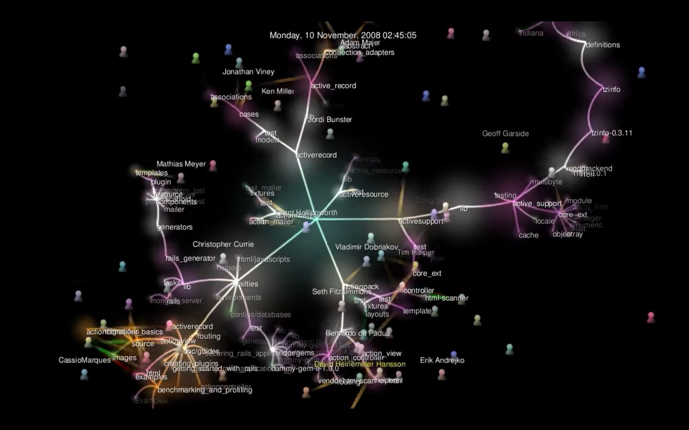

# Notes on git metrics

This document contains various notes on metrics used to measure the progress of git repositories.

## Metrics for dashboard

Since we didn't want to re-invent the wheel, currently we're looking at [CHAOSS](https://chaoss.community/) which is a project under the Linux Foundation. CHAOSS is an initialism for **C**ommunity **H**ealth **A**nalytics **O**pen **S**ource **S**oftware.

CHAOSS develops and maintains [a set of metrics](https://chaoss.community/metrics/) (also see [here](https://github.com/chaoss/metrics) for more details) to measure the health of an open source software project. The list is long, but I encourage everyone to skim through this list to get a feel for what they're thinking. Some general thoughts:

* Some metrics are clearly of interest to us, just a few examples:
  * QUANTITATIVE: the *elephant/bus factor*, which is related to the diversity and work distribution about contributors.
  * BINARY: Is there a license for the project?
  * BINARY: Does the project have contributor guidelines?
* Some are not as clearly directly useable, such as:
  * Test coverage for code - Is there an equivalent for hardware design files???
* Some are promising, and this is where I think I'd love to get into on how to adapt them in an open source hardware context:
  * QUANTITATIVE: Frequency and consistenty of commits, merges, and pull requests
  * QUANTITATIVE & QUALITATIVE: Diversity and inclusion of online and offline participation - E.g. gender, age, ethnicity, and other diversity indices, is everyone welcome?
  * QUALITATIVE (?): Onboarding for newcomers, ease of contribution

Wikifactory would like to consider good practices as documented in this [fictiv Hardware Guide](https://www.fictiv.com/hwg/) for the dashboard.

Other than CHAOSS, there is also an initiative called [All Contributors](https://github.com/all-contributors/all-contributors) that seeks to recognise the contribution from all people, not just programmers who contribute code. There is a proposed badge system, which from our perspective might allow differentiating between different types of contributions from people associated with an OSH project.

### Challenges for open source hardware

Applying, adding to, or modifying CHAOSS metrics to the context of open source hardware has come challenges. For example:

* Many hardware CAD files are stored in (often proprietary) binary formats, or at least in formats not meant to be read as code.
* There's some work (Gopsill et al.) using the temporal proximity of file edits to infer directional dependency relationships. However, git commits mean files are often edited "simultaneously" within the same commit, so no directionality can be derived. Or can it?

## Existing dashboard implementations

### KiBiter/GrimoireLab

A company called [Bitergia](https://bitergia.com/) has implemented CHAOSS metrics into their product: a customisable dashboard for softare companies that Bitergia sets up for them as a consultant. Their [dashboard](https://bitergia.netlify.app/bitergia-analytics/) looks impressive, and can pull data not just from git repositories, but also issue trackers, continous integration tools, mailing lists (analyse with natural language processing???), chat (e.g. IRC, Matrix, Slack), wikis, or social media.

For a full example of an implemented dashboard, look [here](https://katacontainers.biterg.io/app/kibana#/dashboard/690980f0-2886-11e9-b662-975152e57997).

The dashboard's underlying software is called [KiBiter](https://github.com/chaoss/grimoirelab-kibiter) (which is forked from [Kibana](https://en.wikipedia.org/wiki/Kibana)). Are the Wikifactory people familiar with it?

Here is a screenshot of of the dashboard showing data on the [OpenShift](https://en.wikipedia.org/wiki/OpenShift) project:

There's a wealth of data that can be used in Bitergia's dashboard for analytics, but the question is how do we do this for open source hardware projects?

**The CEO of Bitergia has got in touch with me, and he is interested in having a conversation**. I will be happy to talk to him, especially once we have some feedback/input from all of you.

KiBiter is one component of a CHAOSS project called [GrimoireLab](https://chaoss.github.io/grimoirelab-tutorial/). GrimoireLab has many components related to open source data analytics. One of which is [Perceval](http://github.com/chaoss/grimoirelab-perceval), which is used to mine the data displayed by KiBiter. Right now, we are using the Perceval Python library to pull data from the Github repositories we're studying to assemble development histories.

### Augur

[Augur](https://github.com/chaoss/augur/) is a "Python library and web service for Open Source Software Health and Sustainability metrics & data collection." It is also a project under CHAOSS, and looks similar to KiBiter. Here is a dashboard screenshot showing [Augur visualising metrics for the KiBiter project](http://augur.osshealth.io/repo/chaoss/grimoirelab-kibiter/overview):

I am also in touch with one of the main developers behind Augur, [Dr Sean Goggins](http://www.seangoggins.net/) from the University of Missouri. He said he's happy to answer questions and even take a quick look at our data.

### Grafana 

[grafana](https://grafana.com/) "allows you to query, visualize, alert on and understand your metrics no matter where they are stored. Create, explore, and share dashboards with your team and foster a data driven culture"

## Useful stuff for consideration in dashboard

Here are some useful stuff (which might not necessarily be a, or a part of a, dashboard per-se) that are potential components of the dashboard we develop.

### Existing dashboard implementations

Don't forget to consider existing implementations as desribed earlier in this document.

### GitHub repo Insights tab

* [Community profile](https://github.com/lovasoa/whitebophir/community)
  * This provides a checklist that maps a repository to GitHub's [recommended community standards](https://opensource.guide/) (which, by the way, is itself worth looking at for our dashboard).
  * I remember @mkampik mentioning the concept of "project stages", perhaps a checklist like this can be adapted to an open source hardware project.
  * For example, each checklist item could represent a certain quantitative measure derived from a project's metadata (such as the bus factor), and will automatically checked off once a threshold is reached. And depending on which items are checked, a community would be put into a certain stage (that comes with a badge!).

### Interaction graphs

Accessing events stored such as commits or other events captured by Git based platforms (GitHub, Wikifactory) such as issues and comments, we can build interaction graphs giving an overview of collaborative activities in the project. See the very simple example below generated from the repository WP2.2_dev based on file change events.

From such networks, it is possible to generate metrics such as:
 - Centrality index: indicates the relative importance of all nodes in a graph. High index indicates the project is centered around one or few central people.
 - Clustering index: indicates the degree to which nodes tend to cluster
together. An average clustering coefficient indicates contributors are clustered in subgroups of three or more people directly working on the same files. 
 - Some interpretation of the [bus factor](https://en.wikipedia.org/wiki/Bus_factor): computed as the minimum number of team members that have to suddenly disappear for the interaction graph to be disconnected into subgraphs.
 - Completeness: ratio between the number of edges in the graph and the number of edges the graph would have, would it be complete. This gives an average value of how many people each contributor works with.

Such graphs can also give some idea about:
- the relative contributions of people in the project and can participate to "gamification". Different kinds of contributions can be displayed (e.g. comments in issues and commits), either alternatively, side by side or integrated in a common weighed score.
- the evolution of participants from periphery to core (see for example [this study](https://link.springer.com/chapter/10.1007/978-3-319-65151-4_21))

Furthermore, plotting the evolution of this graph over time (from project start to now) can give some insights about the community dynamics: is it booming, stalling or declining? Is it stable or a "come-and-go" project? etc

See also [this blogpost](https://reticular.hypotheses.org/1745) about using graph topology metrics and their meaning for social network analysis.

See also [gource](https://gource.io/), a visualisation of interactions between developpers and the repo tree structure: 

### Design structure matrices (DSMs)

[Design structure matrices](https://en.wikipedia.org/wiki/Design_structure_matrix), also called dependency structure matrices, in short DSM, provide a graphical overview of dependencies between elements of an assembly. It allows judging on the modularity, the granularity and the complexity of a system. They are "widely known for their ability to support engineers in the management of dependencies across product and organisational architectures." [1] More broadly speaking, a DSM has potential to be a simple, compact visual representation of a complex system.

Here is a simple example (from [here](https://commons.wikimedia.org/wiki/File:A_sample_Design_Structure_Matrix_(DSM).png#/media/File:A_sample_Design_Structure_Matrix_(DSM).png), [CC BY-SA 3.0](https://creativecommons.org/licenses/by-sa/3.0)):

The rows and columns of this DSM show the elements of a system (A, B, C, etc.), while the "1"s are connections between elements. An obvious use case would be to visualise the dependency relationships between source code files in a software project.

A more complex example (taken from [2]):

Components of an assembly are represented as row and columns of a square matrix and the value in cell (n,m) represent the interaction between subcomponents n and m. From there, it is possible to use clustering algorithms and other processing techniques (partitionning, sequencing) to discover structural features that are not visible at first sight. For example:

* loops (A depends on B, who depends on C, who depends on A)
* independent modules
* bus modules / structural elements

Interactions between components are generally defined based on how much components interact with each others (whether they touch each others, are aligned to each others, exchange energy or movement, exchange information, etc.) DSMs are also generally generated manually by a system engineer who has an overview of the system. However, the wide use of product data management system with file versioning history opens the possibility to generate DSMs automatically based on co-occurrence of file changes: if two files are generally edited in a common short time frame, it may mean that they are interdependent. According to [1] who tested this technique on a Student Formula car development: "Recent work in the field has exploited product lifecycle management systems to generate DSMs via the co-occurrence of edits to engineering files. These are referred to as dynamic DSMs and results have demonstrated both the efficacy and accuracy of dynamic DSMs in representing engineering work and emergent product architectures. " 

[1]: Gopsill, J., Snider, C., & Hicks, B. (2019). The emergent structures in digital engineering work: What can we learn from dynamic DSMs of near-identical systems design projects? Design Science, 5, E28. doi:10.1017/dsj.2019.20

[2]: Nomaguchi, Y., Tsutsumi, D., & Fujita, K. (2007). Design process planning from a viewpoint of progressive nature of knowledge acquisition. In DS 42: Proceedings of ICED 2007, the 16th International Conference on Engineering Design, Paris, France, 28.-31.07. 2007 (pp. 679-680).

Some notes and observations:

1. The connections between elements clearly don't have to be "1"s, they can be weighted to represent the any quatitative measure of those connections.

2. There can be *directionality* in DSMs which can show how elements of a design depend on each other.

3. As mentioned earlier in this document, Gopsill et al. used DSMs to capture dependency relationships between hardware design files. However, that work used the temporal proximity of file changes to infer the directionality of dependencies. How can this directionality be derived from version control systems such as git?

4. This visualisation does not have to be only for hardware designs, perhaps it can be used to show social and/or organisational structure of development communities?

5. DSMs are basically a specific case of adjacency matrices, which should not be difficult to implement in Python. See [this article](https://medium.com/techmacademy/graphs-adjacency-matrix-behind-the-scenes-visual-tour-6512493912c0) and [this post](https://stackoverflow.com/q/29464252/186904) for simple examples.

### What could be the dashboard used for

- Give an idea of "what kind of project it is"
  - insights into the technology (like GitHub bar indicating which languages are used)
  - activity graph / participant network
- Give an pproximate measure of what we mean with success:
  - number of downloads / views
  - number of commits
  - stability of commits
- Provide insights to guide projects
  - way to encourage projects adopting the mantra "release early, release often".
  - give guidance based on project phase (discover the phases or tie the analyses in theses phases declared by the user)

### Notes from meeting 2020/07/10

Possible feature 1: Interaction graphs:
-  "replay" the history of the project (similarly to what [gource](https://gource.io/) does) 
-  provide interactive screenshots where the user can click on nodes or edges and see some stats, for example:
   -  what the contributor contibute to (hardware, software, whatever the meaning categories)
   -  some kind of appreciation of the role of the user (e.g. data source or data sink, the man in the middle, peripheral developper, or whatever category we can imagine based on graph stats)

Possible feature 2: appreciation of project type. We could place projects on map of archetypes based on characteristics. Distance is given by simiarity (number of common characteristics divided by number of characteristics). What  could be such characteristics?
 - "this project seem to be heavily centred on one person"
 - "there has been a steady increase in contributions over time"
 - "the project started iwth a large dump so..."
 - "not many interactions but dumps here and there, indicating the interactions happen elsewhere"
 - "there is a contribution guide (contributing.md), a license, a readme"....
 - high bus factor, high centrality, other CHAOS metrics...

These characteristics can be also voiced as plain text. 

Design rationale: modularize the dashboard, data and views.