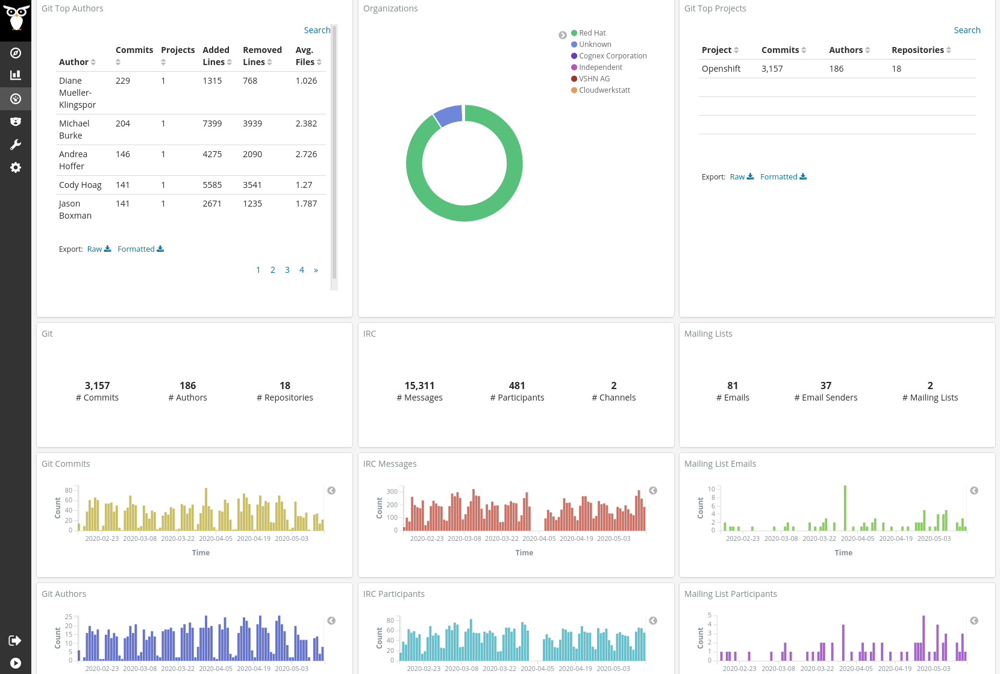
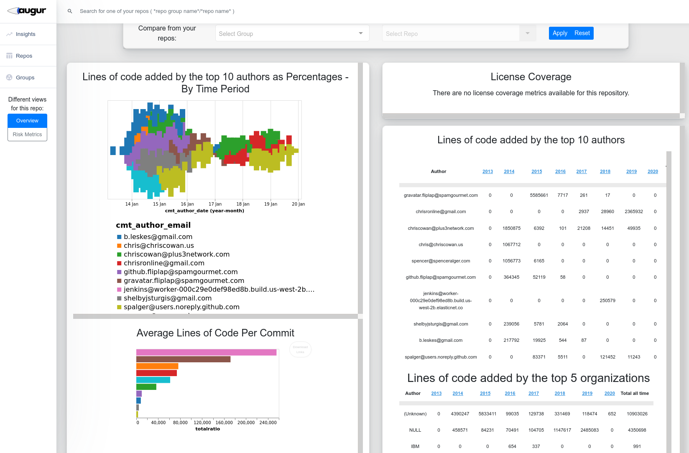

# Notes on git metrics

This document contains various notes on metrics used to measure the progress of git repositories.

## Metrics for dashboard

Since we didn't want to re-invent the wheel, currently we're looking at [CHAOSS](https://chaoss.community/) which is a project under the Linux Foundation. CHAOSS is an initialism for **C**ommunity **H**ealth **A**nalytics **O**pen **S**ource **S**oftware.

CHAOSS develops and maintains [a set of metrics](https://chaoss.community/metrics/) to measure the health of an open source software project. The list is long, but I encourage everyone to skim through this list to get a feel for what they're thinking. Some general thoughts:

* Some metrics are clearly of interest to us, just a few examples:
  * QUANTITATIVE: the *elephant/bus factor*, which is related to the diversity and work distribution about contributors.
  * BINARY: Is there a license for the project?
  * BINARY: Does the project have contributor guidelines?
* Some are not as clearly directly useable, such as:
  * Test coverage for code - Is there an equivalent for hardware design files???
* Some are promising, and this is where I think I'd love to get into on how to adapt them in an open source hardware context:
  * QUANTITATIVE: Frequency and consistenty of commits, merges, and pull requests
  * QUANTITATIVE & QUALITATIVE: Diversity and inclusion of online and offline participation - E.g. gender, age, ethnicity, and other diversity indices, is everyone welcome?
  * QUALITATIVE (?): Onboarding for newcomers, ease of contribution

## Existing dashboard implementations

### KiBiter/GrimoireLab

A company called [Bitergia](https://bitergia.com/) has implemented CHAOSS metrics into their product: a customisable dashboard for softare companies that Bitergia sets up for them as a consultant. Their [dashboard](https://bitergia.netlify.app/bitergia-analytics/) looks impressive, and can pull data not just from git repositories, but also issue trackers, continous integration tools, mailing lists (analyse with natural language processing???), chat (e.g. IRC, Matrix, Slack), wikis, or social media.

The dashboard's underlying software is called [KiBiter](https://github.com/chaoss/grimoirelab-kibiter) (which is forked from [Kibana](https://en.wikipedia.org/wiki/Kibana)). Are the Wikifactory people familiar with it?

Here is a screenshot of of the dashboard showing data on the [OpenShift](https://en.wikipedia.org/wiki/OpenShift) project:

There's a wealth of data that can be used in Bitergia's dashboard for analytics, but the question is how do we do this for open source hardware projects?

**The CEO of Bitergia has got in touch with me, and he is interested in having a conversation**. I will be happy to talk to him, especially once we have some feedback/input from all of you.

KiBiter is one component of a CHAOSS project called [GrimoireLab](https://chaoss.github.io/grimoirelab-tutorial/). GrimoireLab has many components related to open source data analytics. One of which is [Perceval](http://github.com/chaoss/grimoirelab-perceval), which is used to mine the data displayed by KiBiter. Right now, we are using the Perceval Python library to pull data from the Github repositories we're studying to assemble development histories.

### Augur

[Augur](https://github.com/chaoss/augur/) is a "Python library and web service for Open Source Software Health and Sustainability metrics & data collection." It is also a project under CHAOSS, and looks similar to KiBiter. Here is a dashboard screenshot showing [Augur visualising metrics for the KiBiter project](http://augur.osshealth.io/repo/chaoss/grimoirelab-kibiter/overview):

I am also in touch with one of the main developers behind Augur, [Dr Sean Goggins](http://www.seangoggins.net/) from the University of Missouri. He said he's happy to answer questions and even take a quick look at our data.