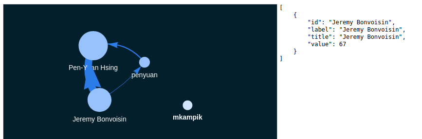

# Notes on git metrics

This document contains various notes on metrics used to measure the progress of git repositories.

## Metrics for dashboard

Since we didn't want to re-invent the wheel, currently we're looking at [CHAOSS](https://chaoss.community/) which is a project under the Linux Foundation. CHAOSS is an initialism for **C**ommunity **H**ealth **A**nalytics **O**pen **S**ource **S**oftware.

CHAOSS develops and maintains [a set of metrics](https://chaoss.community/metrics/) (also see [here](https://github.com/chaoss/metrics) for more details) to measure the health of an open source software project. The list is long, but I encourage everyone to skim through this list to get a feel for what they're thinking. Some general thoughts:

* Some metrics are clearly of interest to us, just a few examples:
  * QUANTITATIVE: the *elephant/bus factor*, which is related to the diversity and work distribution about contributors.
  * BINARY: Is there a license for the project?
  * BINARY: Does the project have contributor guidelines?
* Some are not as clearly directly useable, such as:
  * Test coverage for code - Is there an equivalent for hardware design files???
* Some are promising, and this is where I think I'd love to get into on how to adapt them in an open source hardware context:
  * QUANTITATIVE: Frequency and consistenty of commits, merges, and pull requests
  * QUANTITATIVE & QUALITATIVE: Diversity and inclusion of online and offline participation - E.g. gender, age, ethnicity, and other diversity indices, is everyone welcome?
  * QUALITATIVE (?): Onboarding for newcomers, ease of contribution

Wikifactory would like to consider good practices as documented in this [fictiv Hardware Guide](https://www.fictiv.com/hwg/) for the dashboard.

Other than CHAOSS, there is also an initiative called [All Contributors](https://github.com/all-contributors/all-contributors) that seeks to recognise the contribution from all people, not just programmers who contribute code. There is a proposed badge system, which from our perspective might allow differentiating between different types of contributions from people associated with an OSH project.

### Challenges for open source hardware

Applying, adding to, or modifying CHAOSS metrics to the context of open source hardware has come challenges. For example:

* Many hardware CAD files are stored in (often proprietary) binary formats, or at least in formats not meant to be read as code.
* There's some work (Gopsill et al.) using the temporal proximity of file edits to infer directional dependency relationships. However, git commits mean files are often edited "simultaneously" within the same commit, so no directionality can be derived. Or can it?

## Existing dashboard implementations

### KiBiter/GrimoireLab

A company called [Bitergia](https://bitergia.com/) has implemented CHAOSS metrics into their product: a customisable dashboard for softare companies that Bitergia sets up for them as a consultant. Their [dashboard](https://bitergia.netlify.app/bitergia-analytics/) looks impressive, and can pull data not just from git repositories, but also issue trackers, continous integration tools, mailing lists (analyse with natural language processing???), chat (e.g. IRC, Matrix, Slack), wikis, or social media.

For a full example of an implemented dashboard, look [here](https://katacontainers.biterg.io/app/kibana#/dashboard/690980f0-2886-11e9-b662-975152e57997).

The dashboard's underlying software is called [KiBiter](https://github.com/chaoss/grimoirelab-kibiter) (which is forked from [Kibana](https://en.wikipedia.org/wiki/Kibana)). Are the Wikifactory people familiar with it?

Here is a screenshot of of the dashboard showing data on the [OpenShift](https://en.wikipedia.org/wiki/OpenShift) project:

There's a wealth of data that can be used in Bitergia's dashboard for analytics, but the question is how do we do this for open source hardware projects?

**The CEO of Bitergia has got in touch with me, and he is interested in having a conversation**. I will be happy to talk to him, especially once we have some feedback/input from all of you.

KiBiter is one component of a CHAOSS project called [GrimoireLab](https://chaoss.github.io/grimoirelab-tutorial/). GrimoireLab has many components related to open source data analytics. One of which is [Perceval](http://github.com/chaoss/grimoirelab-perceval), which is used to mine the data displayed by KiBiter. Right now, we are using the Perceval Python library to pull data from the Github repositories we're studying to assemble development histories.

### Augur

[Augur](https://github.com/chaoss/augur/) is a "Python library and web service for Open Source Software Health and Sustainability metrics & data collection." It is also a project under CHAOSS, and looks similar to KiBiter. Here is a dashboard screenshot showing [Augur visualising metrics for the KiBiter project](http://augur.osshealth.io/repo/chaoss/grimoirelab-kibiter/overview):

I am also in touch with one of the main developers behind Augur, [Dr Sean Goggins](http://www.seangoggins.net/) from the University of Missouri. He said he's happy to answer questions and even take a quick look at our data.

## Useful stuff for consideration in dashboard

Here are some useful stuff (which might not necessarily be a, or a part of a, dashboard per-se) that are potential components of the dashboard we develop.

### GitHub repo Insights tab

* [Community profile](https://github.com/lovasoa/whitebophir/community)
  * This provides a checklist that maps a repository to GitHub's [recommended community standards](https://opensource.guide/) (which, by the way, is itself worth looking at for our dashboard).
  * I remember @mkampik mentioning the concept of "project stages", perhaps a checklist like this can be adapted to an open source hardware project.
  * For example, each checklist item could represent a certain quantitative measure derived from a project's metadata (such as the bus factor), and will automatically checked off once a threshold is reached. And depending on which items are checked, a community would be put into a certain stage (that comes with a badge!).

### Playing with interaction graphs

Accessing events stored such as commits or other events captured by Git based platforms (GitHub, Wikifactory) such as issues and comments, we can build interaction graphs giving an overview of collaborative activities in the project. See the very simple example below generated from the repository WP2.2_dev based on file change events.

From such networks, it is possible to generate metrics such as:
 - Centrality index: indicates the relative importance of all nodes in a graph. High index indicates the project is centered around one or few central people.
 - Clustering index: indicates the degree to which nodes tend to cluster
together. An average clustering coefficient indicates contributors are clustered in subgroups of three or more people directly working on the same files. 
 - Some interpretation of the [bus factor](https://en.wikipedia.org/wiki/Bus_factor): computed as the minimum number of team members that have to suddenly disappear for the interaction graph to be disconnected into subgraphs.
 - Completeness: ratio between the number of edges in the graph and the number of edges the graph would have, would it be complete. This gives an average value of how many people each contributor works with.

Such graphs can also give some idea about:
- the relative contributions of people in the project and can participate to "gamification". Different kinds of contributions can be displayed (e.g. comments in issues and commits), either alternatively, side by side or integrated in a common weighed score.
- the evolution of participants from periphery to core (see for example [this study](https://link.springer.com/chapter/10.1007/978-3-319-65151-4_21))

Furthermore, plotting the evolution of this graph over time (from project start to now) can give some insights about the community dynamics: is it booming, stalling or declining? Is it stable or a "come-and-go" project? etc

See also [this blogpost](https://reticular.hypotheses.org/1745) about using graph topology metrics and their meaning for social network analysis.

### Playing with Design Structure Matrices

[TODO]
