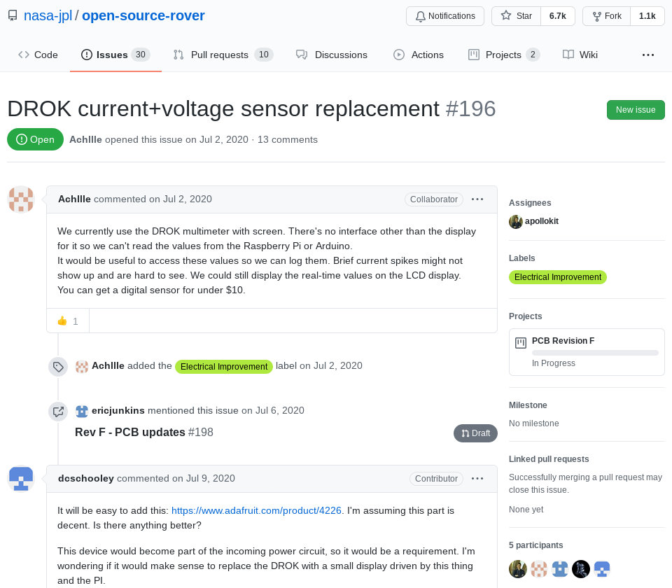

# Example walkthrough for `wp2.2_dev`

## Abstract

This document provides a detailed step-by-step example of using the scripts provided in the `osmine` and `osdash` Python modules as part of the OPEN-NEXT project's WP2.2 month-18 deliverable. It is an annex to the main documentation [here](../README.md) which should be read first. The walkthrough included here will cover identifying an open source hardware project's version control repository; adding the repository's information into an input file for the data-mining script; running the data-mining script; producing a simple, demonstration web dashboard to view the mined data; with an overview of key file types and locations used in the above steps. The target users of the month-18 deliverable are online version control platforms such as [Wikifactory](https://wikifactory.com/) or [GitHub](https://github.com/) to add analytics and visualisation capabilities, *not* general "end users". Therefore, existing knowledge and skills in GNU/Linux server administration, version control with [Git](https://git-scm.com/), and running Python scripts are needed.

- [Example walkthrough for `wp2.2_dev`](#example-walkthrough-for-wp22_dev)
  - [Abstract](#abstract)
  - [Prerequisites](#prerequisites)
  - [Step-by-step example](#step-by-step-example)
    - [An example open source hardware repository](#an-example-open-source-hardware-repository)
    - [Prepare input for data-mining module `osdash`](#prepare-input-for-data-mining-module-osdash)
    - [Prepare local copy of the data-mining scripts](#prepare-local-copy-of-the-data-mining-scripts)
    - [Run the `osmine` data-mining scripts](#run-the-osmine-data-mining-scripts)
    - [Examine contents of mined repository metadata](#examine-contents-of-mined-repository-metadata)
    - [Display repository metadata in a web-based demonstrator dashboard](#display-repository-metadata-in-a-web-based-demonstrator-dashboard)
  - [Summary](#summary)
  - [License](#license)

## Prerequisites

**This guide assumes working knowledge of GNU/Linux server administration, version control with [Git](https://git-scm.com/), and running Python scripts.** To follow along, you will need user-level access to such a server with at least the software Git (version 2.7 or later) and Python (version 3.8 or later) installed. You should also have working knowledge of commandline operations in a terminal. Additionally, you should have a [GitHub](https://www.github.com/) account in good standing with a [GitHub personal access token](https://docs.github.com/en/github/authenticating-to-github/creating-a-personal-access-token) in order to work through the example below.

## Step-by-step example

### An example open source hardware repository

The primary function of the month-18 deliverable is a set of Python scripts to mine metadata from open source hardware version control repositories. The example repository to mine from is the GitHub repository of the [Open Source Rover Project](https://opensourcerover.jpl.nasa.gov/) developed by the [Jet Propulsion Laboratory (JPL)](https://en.wikipedia.org/wiki/Jet_Propulsion_Laboratory) of the United States [National Aeronautics and Space Administration (NASA)](https://en.wikipedia.org/wiki/NASA). This rover is functionally similar to the ones that have been deployed on Mars. With the Open Source Rover project as an example, this section will note some key characteristics of a GitHub-hosted repository to be revisited in later sections.

1. Visit the [homepage of the JPL Open Source Rover project](https://opensourcerover.jpl.nasa.gov/) in your web browser. Notice that this page presents information about the project including interactive elements, but it is *not* where the actual design files of the rover are stored and managed. Instead, open source hardware (and software) projects often manage their sources files (such as computer-aided-design (CAD) files or code) using a version control software called [Git](https://git-scm.com/). The repositories containing these version-controlled files are then hosted on online platforms such as, but not limited to, [GitHub](https://github.com/).
   
   

   ***Figure 1.** Screenshot of the JPL Open Source Rover's home page which does not contain its actual design files.*

2. The Git repository for the Open Source Rover is hosted on GitHub here: [`https://github.com/nasa-jpl/open-source-rover`](https://github.com/nasa-jpl/open-source-rover) Open this link in your web browser and you should see main page of the repository which resembles the following: 

     

    ***Figure 2.** Screenshot of the JPL Open Source Rover GitHub repository's main page.*

3. A key advantage of using Git for version control is the ease with which one could record and revisit the history of changes made to files in a repository. Each of the recorded changes is called a "commit". On the GitHub page opened in the previous step, click on the icon resembling a clock with a counter clockwise circle/arrow to see the complete history of commits: 

    

    ***Figure 3.** Link on GitHub repository page (circled in red) to view complete commit history.*

4. You should now see a long list of commits made to the Open Source Rover repository, organised by date. As an example, scroll down and find commits made on "Mar 25, 2021". There should be only a single entry for this day that looks like this: 

    

    ***Figure 4.** A typical commit - made on 25 March 2021 - in a GitHub repository commit history.*

    The title of this commit is "Merge pull request #240 from SConaway/pcb-assembly". Click on the title to reveal details of this commit. To save time scrolling through the repository history to find this commit, this is a direct link to its details page: [`https://github.com/nasa-jpl/open-source-rover/commit/ccfa9c138bc045937dc7db846930d613cf7469a9`](https://github.com/nasa-jpl/open-source-rover/commit/ccfa9c138bc045937dc7db846930d613cf7469a9)

5. This page provides detailed information on which changes were made to which files as part of the commit. For the purposes of this walkthrough, make note of (1) the user "`apollokit`" who made the commit; (2) the date of 25 March (in 2021); (3) the commit hash "`ccfa9c138bc045937dc7db846930d613cf7469a9`" (this hash is an alphanumeric string that uniquely identifies this commit).
   
    

   ***Figure 5.** GitHub details page for a typical commit.*

6. So far, we have seen features built into the Git version control software. GitHub provides additional features on top of Git such as the ability for participants in an open source project to open and close tickets discussing their work. In GitHub these are called "Issues" and can be reached by clicking its eponymous link on the top of the page. Click on it: 

    

    ***Figure 6.** Link to GitHub Issues (actual number of currently open issues, 30 in this example, may vary).*

7. The GitHub Issues page shows topics currently under discussion by participants. At time of writing, there are 30 open and 170 closed Issues for the Open Source Rover repository (actual numbers may vary by the time you see them): 

    

    ***Figure 7.** GitHub Issues page (30 open and 170 closed Issues).*

8. As an example, scroll down the page to find Issue #196 "opened on Jul 2, 2020 by Achllle" titled "DROK current+voltage sensor replacement". Click on the title to see the discussion thread. If it is no visible by the time you read this, click on the following link: [`https://github.com/nasa-jpl/open-source-rover/issues/196`](https://github.com/nasa-jpl/open-source-rover/issues/196) You should now see the conversation: 

     

    ***Figure 8.** Typical page of a GitHub Issue.*

    Again, note for later reference that this issue #196 was opened by user "`Achllle`" on 2 July 2020, is "Open" (at time of writing), and there are "5 participants" in the discussion. You can see the list of participants near the bottom of the right side bar, or by noting each user name that appears in the thread.

9. The previous steps illustrate metadata commonly associated with a version control repository including commits, GitHub Issues, authorship information on those activities and their timestamps. To programmatically *mine* this metadata with the Python scripts in the month-18 deliverable, we need to note the URL (URL stands for [uniform resource locator](https://en.wikipedia.org/wiki/URL) which is often colloquially referred to as an "address") of the repository: [`https://github.com/nasa-jpl/open-source-rover/`](https://github.com/nasa-jpl/open-source-rover/) With this information, we can prepare the input data for the data-mining module `osmine`.

### Prepare input for data-mining module `osdash`

1. The data-mining scripts accept a single input file containing a list of version control repository URLs. In this walkthrough, we will add one URL to this list, that of the JPL Open Source Rover project: [`https://github.com/nasa-jpl/open-source-rover/`](https://github.com/nasa-jpl/open-source-rover/)
2. The list should be saved in CSV ([comma-separated values](https://en.wikipedia.org/wiki/Comma-separated_values)) format. To create this list, create a new spreadsheet using your spreadsheet software. In this new sheet, enter the following into the first row (usually called row 1) in the following order from left to right: `project`, `repo_url`, `repo_platform`, and `notes` (they are case-sensitive). In the row below that, enter: `JPL Open Source Rover`, `https://github.com/nasa-jpl/open-source-rover/`, `GitHub`. The last column `notes` can be left empty, it is for you to enter any other information for your own reference. Of particular importance are the `repo_url` and `repo_platform` columns which the data-mining scripts rely on. Once you are done, the contents of your spreadsheet should look like the following: 
   
   

   ***Figure 9.** Entering a list of repositories to mine into a spreadsheet to be saved as a CSV file.*

3. This spreadsheet must be saved in the CSV format. To do so, save what you have as a new file named `OSH-repos.csv`, and be sure to choose CSV (comma-separate values) as the format/filetype and that the file extension is `.csv` instead of common spreadsheet extensions such as `.ods` or `.xlsx`.

### Prepare local copy of the data-mining scripts

1. In this example, we will run a local copy of the data-mining scripts (and in later steps, the demo dashboard) on your system. To begin, open a terminal window and navigate to the location where you would like to place these files.
2. Clone the GitHub repository containing the scripts onto your system by entering the following command: 
   
   ```sh
   git clone https://github.com/OPEN-NEXT/wp2.2_dev.git
   ```

3. Observe the contents of the `wp2.2_dev` directory that was just created and populated. You can use the `ls` command in your terminal or open that directory in your graphical file manager, in which case you should see something like this: 

    

    ***Figure 10.** Contents of the `wp2.2_dev` Git repository containing the data-mining scripts.*

4. Place the CSV list containing the URL of the JPL Open Source Rover repository (which you named as `OSH-repos.csv`) into the `input` directory. Overwrite or remove any files already there.
5. The `data` directory contains sample output from the data-mining scripts. For the purposes of this walkthrough, remove everything in the `data` directory (there should be only one file). This way, we can in later steps examine the output from running the scripts against the JPL Open Source Rover repository.
6. Since the JPL Open Source Rover repository is hosted on GitHub and it will be queried via the data-mining scripts, we need a [GitHub personal access token](https://docs.github.com/en/github/authenticating-to-github/creating-a-personal-access-token). This token can be generated from your GitHub account and is an alphanumeric string of 40 characters that resembles the following: `GNcAm5YWtUu66dq88LKS8R8D2Ck2UzikABSNqZyr` Instructions for generating this token can be found [here in the GitHub documentation](https://docs.github.com/en/github/authenticating-to-github/creating-a-personal-access-token).
7. Copy and paste that 40-character string into a *pure text* file and save it within the `wp2.2_dev` repository with the name `token` (no file extension needed). The *only* contents of this pure text file should be those exact 40 characters, nothing else. If successful, you should see this new file along with everything else: 
   
   

   ***Figure 11.** GitHub personal access token saved in a file named `token` among other files in the `wp2.2_dev` repository.*

8. You will also need to install library dependencies that are needed by the data-mining scripts. The dependencies for this repository are listed in the standard-conformant file `requirements.txt`. To install them, run this command in your terminal window: 

    ```sh
    pip install --user -r requirements.txt
    ```

### Run the `osmine` data-mining scripts

1. Now, we can ask the Python module `osmine` (which contains the data-mining scripts) to retrieve metadata from the JPL Open Source Rover project's GitHub repository. Start by having a terminal window open in the `wp2.2_dev` directory.
2. Now, run the `osmine` module to start the data-mining scripts with the following command: 
   
   ```sh
   python osmine -t=./token
   ```

   Note: The `-t` argument passed to the `osmine` module tells it to use your GitHub personal access token stored in the file `token`.

3. If successful, the first lines of terminal output after executing the command should resemble the following (details may vary): 
   
   

   ***Figure 12.** First lines of output from data-mining module `osmine`.*

4. Please wait. It will take up to several minutes or more (depending on the performance of your system's Internet connectivity) for the script to mine data from the JPL Open Source Rover repository hosted on GitHub. In the meantime, there should be additional output in the terminal that looks like the following (again, details will vary): 
   
   

   ***Figure 13.** Typical terminal output when running `osmine`.*

5. Once complete, the data-mining scripts within the `osmine` module will save the metadata of the JPL Open Source Rover repository into a file. Find this file by entering the `data` sub-directory within `wp2.2_dev`. This output file is named `mined_data.zip`. If you navigate to this directory in your graphical file manager, you should see it: 
   
   

   ***Figure 14.** `mined_data.zip` in the `data` directory contains version control repository metadata mined by the `osmine` module.*

### Examine contents of mined repository metadata

1. To view the contents of the mined metadata from the JPL Open Source Rover repository, start by extracting the contents of the compressed file `mined_data.zip`. Most of the time, this is done by double-clicking on `mined_data.zip` in your graphical file manager which reveals its contents. There should be exactly one file inside named `mined_data.json`. Extract this file by dragging and dropping it to a location convenient for you.
   
   

   ***Figure 15.** `mined_data.zip` is a compressed archive containing a file `mined_data.json` which contains mined data from version control repositories.*

2. The file `mined_data.json` is a pure-text file with data organised in [JavaScript Object Notation (JSON)](https://en.wikipedia.org/wiki/JSON), which is a widely-used international open standard for saving structured data. Because it is pure text, open it in a text editor of your choice to view its contents. Once opened, you should see the beginning lines of the file to resemble the following: 

    

    ***Figure 16.** Beginning of `mined_data.json` opened in a text editor, showing basic information about the JPL Open Source Rover GitHub repository.*

    Take a moment to observe the contents of this JSON file. The first 15 lines or so of this file contains basic metadata about the whole JPL Open Source Rover GitHub repository such as the date and time it was first `published` (29 June 2018), the `license` for the design files (Apache 2.0), or the `repo_url` which you visited in your web browser at the beginning of this guide.

3. In previous steps, we have visited [the page](https://github.com/nasa-jpl/open-source-rover/commit/ccfa9c138bc045937dc7db846930d613cf7469a9) of commit `ccfa9c138bc045937dc7db846930d613cf7469a9` made by user `apollokit` on 25 March 2021. In your text editor with the file `mined_data.json` opened, search for the commit hash (just the first five or so characters, `ccfa9`, should be enough) and it should take you to the mined metadata for this commit where you can confirm that it matches what you saw in your web browser: 
   
   

   ***Figure 17.** Mined metadata for commit `ccfa9c138bc045937dc7db846930d613cf7469a9` in the JPL Open Source Rover repository highlighted in red.*

4. We have also visited GitHub Issue #196 in a web browser. Metadata about this Issue is also in `mined_data.json`. A quick way to see it in `mined_data.json` is to search for the Issue title "DROK current+voltage sensor replacement" in your text editor, which should bring you to its entry as follows: 

    

    ***Figure 18.** Mined metadata for GitHub Issue #196 in the JPL Open Source Rover repository highlighted in red.*

    Comparing to what was displayed on the GitHub page for Issue #196, we can confirm that this Issue was indeed `published` on 2 July 2020, has five `participants` and is `attributedTo` the user `Achllle` who first opened it.

### Display repository metadata in a web-based demonstrator dashboard

The data-mining scripts described and demonstrated in the previous sections represent the primary functionality of our OPEN-NEXT month-18 deliverable. This functionality provides the foundation on which an online dashboard could later be built and hosted by version control platforms such as Wikifactory or GitHub to present to their users. To illustrate this potential, we have created a basic, proof-of-concept demonstration in a module named `osdash` that summarises and displays some of the metadata obtained via the data-mining scripts.

1. With the terminal still open at the base of the `wp2.2_dev` directory, enter the following command to start the `osdash` module: 
   
   ```sh
   python osdash
   ```

   This will start a local server using the metadata mined from previous steps and saved in the file `data/mined_data.zip`. The initialisation process should take at least several seconds, after which you should see the following typical output in the terminal: 

   

   ***Figure 19.** Typical terminal output upon successful start of the test server of the proof-of-concept `osdash` dashboard.*

   Make note of the line that reads "`Dash is running on http://127.0.0.1:21110/`". This is the URL at which the demo dashboard can be accessed.

2. In a web browser on the same system in which you ran the `python osdash` command, navigate to the URL `http://127.0.0.1:21110`. You should then see the main page of the demo dashboard: 
   
   

   ***Figure 20.** Typical screenshot of the proof-of-concept dashboard module `osdash` opened in a web browser.*

   Take a moment to observe the different elements of this page. You should be able to see that this dashboard is showing information derived from the metadata mined from the JPL Open Source Rover GitHub repository. At the time the above screenshot was taken, there have been 517 commits to this repository from 88 contributors. There are also 200 open and 170 closed "tickets". The more general term "ticket" is used here because the data-mining scripts in the `osmine` module is designed to pull metadata from repositories hosted on platforms other than GitHub (such as Wikifactory), and not all of them call these discussions "Issues". In addition, the [ForgeFed version control data model](https://forgefed.peers.community/modeling.html) specifies the term "ticket".

   Below that is a graph titled "Commits over time". When this page is first loaded, it shows a bar chart of the monthly number of commits to this repository across its lifetime from when it was first created to now.

   The bottom-most section titled "User activities" shows a list of usernames with their number of commits and tickets participated in. Observe that the users `apollokit` and `Achllle` which were noted in earlier steps are among the most prolific contributors to this repository.

3. On the top left, notice a shaded box named "Choose repository". When the `osmine` module is used to mine metadata from multiple open source projects across repositories hosted on different platforms, those repositories will be selectable via the two menus "1. Select a project" and "2. Select a repository from...". In the current example, since we have only mined data from the JPL Open Source Rover repository, those menus will only have one option each.
   
   There is a third item named "3. Customise timeframe to view". Here, you can use your mouse to drag two sliders to constrain the timeframe of the information shown. Try dragging both and observe how the page changes.

   

   ***Figure 21.** Time slider to filter shown data by time.*

4. As you filter the data shown using the time slider, here are some questions to consider: Does the rate of commits to this repository change over time? Are there certain users who consistently contribute to this project? Are there those who have contributed only during a certain timeframe? What are other questions that could be asked of the mined data?
5. Once you are done, the test server could be terminated in the terminal window by entering `Ctrl-C`.

## Summary

The walkthrough above provided detailed, step-by-step instructions on how to use the `osmine` Python module which is the primary component of the OPEN-NEXT project's WP2.2 month-18 deliverable: The ability to mine metadata from open source hardware version control repositories. This functionality forms the basis for post-month-18 development of an online dashboard that displays information derived from this metadata to inform open source hardware projects on the health of their communities. There is currently a demo dashboard `osdash` which illustrates this potential. All of this is designed to be hosted by platforms providers such as Wikifactory.

## License

[](https://creativecommons.org/licenses/by-sa/4.0/)

This document is shared under the Creative Commons Attribution-ShareAlike 4.0 license.

```
SPDX-FileCopyrightText: 2021 Pen-Yuan Hsing
SPDX-License-Identifier: CC-BY-SA-4.0
```